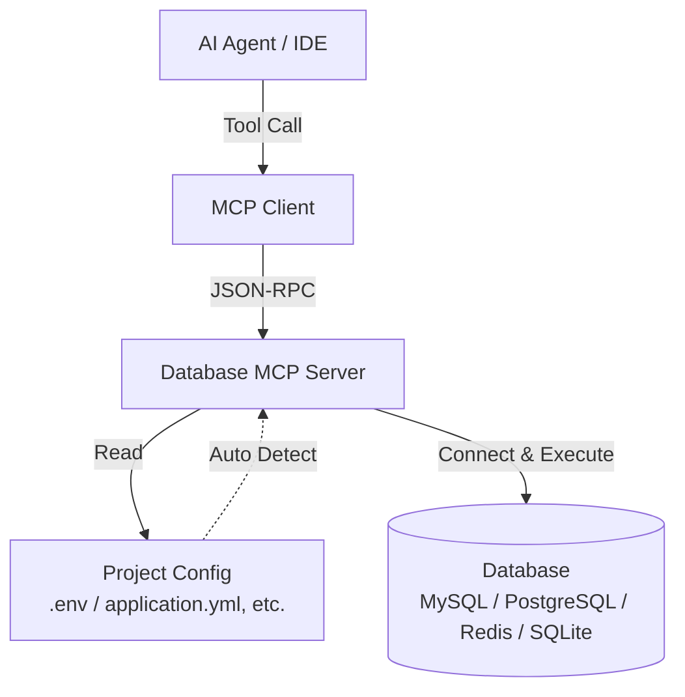

# Database MCP

English | [简体中文](README.zh-CN.md)

[](https://go.dev/)
[](https://modelcontextprotocol.io/)
[](https://github.com/Mingcharun/mingcha_sql_mcp)

An open-source MCP server for database access in AI agents, IDE assistants, and desktop MCP clients.

> Built for the way real projects store database settings: inside repository config files, not only in shell environment variables.

| Start Here | Continue Reading |
| --- | --- |
| [Installation](docs/installation.md) | [Architecture](docs/architecture.md) |
| [Tool Reference](docs/tool-reference.md) | [Development](docs/development.md) |
| [Release Guide](docs/release.md) | [中文说明](README.zh-CN.md) |

Database MCP gives models a clean, structured way to work with:

| Data Source | Core Capabilities |
| --- | --- |
| MySQL | connect, query, write, procedures, status |
| PostgreSQL | connect, query, write, metadata, status |
| Redis | connect, commands, Lua, status |
| SQLite | query, write, project-aware path resolution |

It is built for a real-world constraint many teams have:

database credentials are often not stored in system environment variables. They live inside project files such as `.env`, `application.yml`, `application.properties`, `config.json`, or `config.toml`.

Database MCP can detect those project configs and help the AI connect automatically.

## Why This Project Exists

### Architecture and Execution Logic



Most "AI + database" workflows break down at one of two points:

1. the model does not have a safe, structured execution interface
2. the model does not know where the database configuration lives

Database MCP addresses both:

- it exposes database capabilities as MCP tools
- it adds project-aware config detection so the AI can work directly from repository configuration

This makes it especially useful in PHP, Go, Java, Spring, Node, Python, and mixed monorepo environments.

## Highlights

- Unified MCP interface for MySQL, PostgreSQL, Redis, and SQLite
- Bounded responses with pagination and timeout controls
- Connection lifecycle tools such as `connect`, `status`, and `disconnect`
- Project-aware detection from common config files
- Direct `*_from_project` tools for one-step project-driven connection
- Clean repository structure for long-term maintenance and open-source collaboration

## How The "Automatic" Flow Actually Works

Database MCP does not independently scan or execute against your repository.

The actual runtime flow is:

1. your MCP client starts `database-mcp`
2. the AI sees which MCP tools are available
3. based on your request, the AI chooses the next tool to call
4. if the project stores credentials in files, the AI can call:
   `project_detect_database_configs`
5. after receiving the detected config, the AI can call:
   `mysql_connect_from_project`
   `pgsql_connect_from_project`
   `redis_connect_from_project`
   or `sqlite_query_from_project`
6. once connected, the AI continues with normal query or metadata tools

So the automation comes from tool orchestration by the AI, not from the MCP process acting on its own.

## Supported Project Config Sources

Current project-based detection supports common sources such as:

- `.env`
- `.env.local`
- `application.yml`
- `application.yaml`
- `application.properties`
- `config.json`
- `config.toml`

Supported patterns include:

- host / port / username / password fields
- DSN and URL-based connections
- Spring datasource configuration
- placeholder expansion such as `${DB_HOST}` and `${DB_PORT:5432}`

## Tool Coverage

| Category | Tools |
| --- | ---: |
| MySQL | 11 |
| PostgreSQL | 11 |
| Redis | 6 |
| SQLite | 2 |
| Project Config Detection | 1 |
| Total | 31 |

## Quick Start

### Build from Source

```bash
git clone https://github.com/Mingcharun/mingcha_sql_mcp.git
cd mingcha_sql_mcp
./scripts/build.sh
```

Output:

```text
dist/database-mcp
```

### Install with Script

```bash
curl -fsSL https://raw.githubusercontent.com/Mingcharun/mingcha_sql_mcp/main/scripts/install.sh | bash
```

### Run with npm

```bash
npx -y @mingcharun/database-mcp
```

### First Tool Call for Project-Based Use

If your database credentials live inside the repository, a typical first call is:

```text
project_detect_database_configs
```

Then the AI can continue with one of the project-aware tools:

- `mysql_connect_from_project`
- `pgsql_connect_from_project`
- `redis_connect_from_project`
- `sqlite_query_from_project`

## MCP Client Setup

### Codex

```toml
[mcp_servers.database_mcp]
command = "/absolute/path/to/database-mcp"
```

### Claude Desktop

```json
{
  "mcpServers": {
    "database_mcp": {
      "command": "/absolute/path/to/database-mcp",
      "args": []
    }
  }
}
```

### npm-based Setup

```json
{
  "mcpServers": {
    "database_mcp": {
      "command": "npx",
      "args": ["-y", "@mingcharun/database-mcp"]
    }
  }
}
```

## Typical Usage Patterns

### When credentials are already known

Use the direct tools:

- `mysql_connect`
- `pgsql_connect`
- `redis_connect`
- `sqlite_query`

### When credentials live inside the repository

Use the project-aware sequence:

1. `project_detect_database_configs`
2. one of:
   `mysql_connect_from_project`
   `pgsql_connect_from_project`
   `redis_connect_from_project`
3. query, metadata, or write tools

For SQLite:

1. `project_detect_database_configs`
2. `sqlite_query_from_project`

## Repository Layout

```text
.
├── cmd/database-mcp/           # binary entrypoint
├── internal/service/           # MCP tool registration and handlers
├── internal/database/          # database implementations
├── internal/projectconfig/     # project config detection and parsing
├── docs/                       # project documentation
├── packages/npm/               # npm distribution wrapper
├── scripts/                    # build and install scripts
├── README.md                   # English entry document
└── README.zh-CN.md             # Chinese entry document
```

## Documentation

- Installation: [`docs/installation.md`](docs/installation.md)
- Architecture: [`docs/architecture.md`](docs/architecture.md)
- Tool Reference: [`docs/tool-reference.md`](docs/tool-reference.md)
- Development Guide: [`docs/development.md`](docs/development.md)
- Release Guide: [`docs/release.md`](docs/release.md)

## Validation

```bash
go test ./...
go test -race ./...
go vet ./...
./scripts/build.sh
```

## Design Principles

- make database access usable for agents, not just humans
- keep outputs bounded and predictable
- separate MCP orchestration from database implementation
- support real project configuration layouts
- keep the repository clean and contributor-friendly

---

> **署名：** 明察网安、涉网犯罪技术侦查实验室
