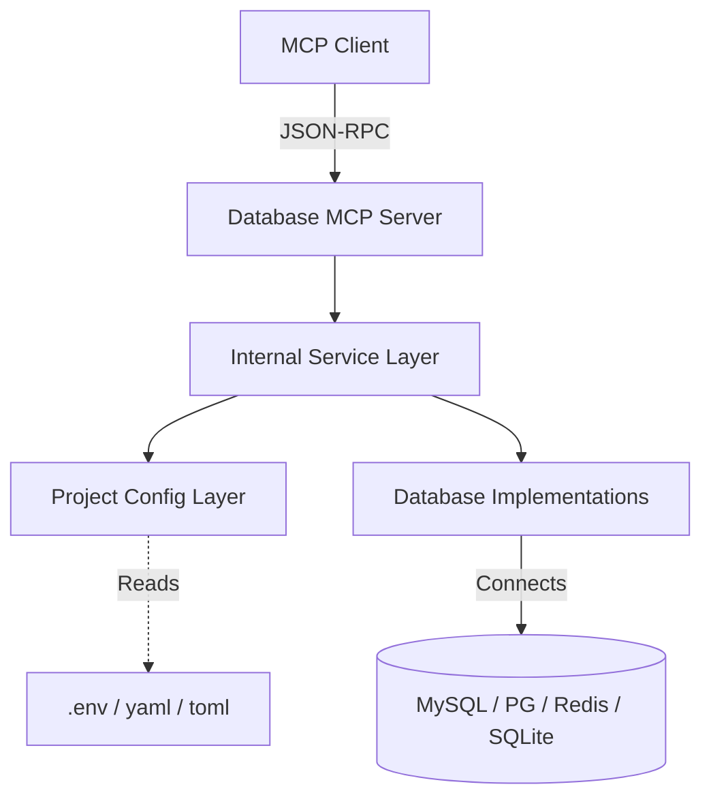

# Architecture

This document explains how Database MCP works, especially the part that often causes confusion:

"If the AI can read project files, how does it automatically use this MCP?"

## Core Idea



Database MCP is an MCP server.

That means it does not act on its own. It exposes tools. The MCP client and the AI decide when to call those tools.

The architecture is:

1. The MCP client launches Database MCP as a stdio process.
2. Database MCP registers tools.
3. The AI receives a user request.
4. The AI chooses one or more tools to call.
5. The MCP client executes those calls.
6. Database MCP returns structured results.

So the automation is not "the server reads your repo by itself". The automation is "the AI decides to call the right project-aware tool sequence".

## End-to-End Flow

### Case A: Credentials are explicitly known

Typical flow:

1. AI calls `mysql_connect`
2. AI calls `mysql_query`
3. AI calls `mysql_status` or `mysql_disconnect` if needed

### Case B: Credentials live inside project config files

Typical flow:

1. AI calls `project_detect_database_configs`
2. Database MCP scans the project directory
3. Database MCP returns detected config candidates
4. AI calls `mysql_connect_from_project` or another project-aware tool
5. Database MCP resolves config and establishes the connection
6. AI continues with normal database tools

### Case C: SQLite inside the repository

Typical flow:

1. AI calls `project_detect_database_configs`
2. AI calls `sqlite_query_from_project`
3. Database MCP resolves the database file path and runs the SQL

## Why This Matters

In many real projects:

- PHP apps use `.env`
- Java and Spring apps use `application.yml` or `application.properties`
- Go services use `.env`, `yaml`, `json`, or `toml`
- Node backends often keep DSN strings in `.env` or `config.*`

If the MCP only supported explicit credentials, the AI would have to:

1. read the repo files
2. extract the right values
3. map them into the right connection arguments
4. then call the connection tool

That works, but it is fragile.

Database MCP now supports doing that parsing step inside the MCP itself.

## Repository Layers

```text
cmd/database-mcp/
  process entrypoint

internal/service/
  MCP tools
  argument handling
  timeouts
  pagination
  connection lifecycle

internal/database/
  MySQL implementation
  PostgreSQL implementation
  Redis implementation
  SQLite implementation

internal/projectconfig/
  project config discovery
  file parsing
  environment placeholder expansion
  database config resolution
```

## Why `internal/projectconfig` Exists

This package is responsible for:

- finding likely config files under a project
- parsing multiple config formats
- flattening nested config structures
- resolving placeholder expressions
- detecting MySQL / PostgreSQL / Redis / SQLite settings

This keeps project config detection separate from database access and separate from MCP tool registration.

## Supported Detection Patterns

Database MCP currently supports common patterns such as:

- host / port / username / password fields
- DSN or URL style config
- Spring datasource config
- Redis URL and host-based config
- SQLite path-based config

It also supports placeholder expansion like:

- `${DB_HOST}`
- `${DB_PORT:5432}`

## What Database MCP Does Not Do

- It does not continuously monitor project files
- It does not automatically execute writes unless the AI chooses write tools
- It does not infer business semantics from your schema
- It does not replace application-level access control

## Security Notes

Project-based auto-detection is powerful, but it should still be used with care:

- treat write tools as high-trust operations
- separate test and production MCP configurations
- prefer read-only investigation before allowing mutation
- use `timeout_ms` and `max_rows` to keep agent behavior predictable

## Recommended Mental Model

Think of Database MCP as the execution layer.

The AI decides:

- what the user wants
- whether to inspect config files
- whether to detect database settings
- which MCP tools to call

Database MCP handles:

- parsing project configs
- connecting to databases
- executing database operations
- returning structured outputs

---

> **署名：** 明察网安、涉网犯罪技术侦查实验室
