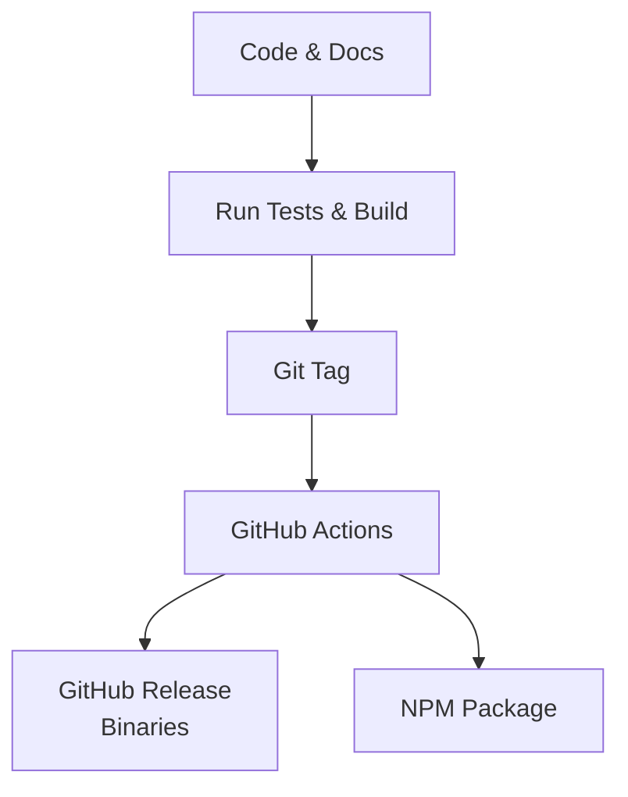

# Release Guide

This guide explains how to build, validate, and publish Database MCP.

## Pre-Release Checklist



Before tagging a release, confirm:

1. `README.md` and `docs/` reflect the current implementation
2. binary naming is consistent across scripts and workflow files
3. npm package metadata matches the intended release
4. tests and static checks pass

## Required Commands

```bash
go test ./...
go test -race ./...
go vet ./...
./scripts/build.sh
```

## Local Build Output

```text
dist/database-mcp
```

## GitHub Actions Workflow

Workflow file:

```text
.github/workflows/release.yml
```

It is responsible for:

- building release binaries
- packaging multi-platform artifacts
- publishing GitHub releases
- publishing the npm wrapper

## npm Wrapper Notes

The npm package under `packages/npm` is a distribution wrapper, not the core implementation.

Its responsibilities are:

- expose `npx -y @mingcharun/database-mcp`
- detect platform and architecture
- download the matching GitHub release binary
- launch the downloaded binary through the npm entrypoint

Key files:

- `packages/npm/package.json`
- `packages/npm/install.js`
- `packages/npm/bin/database-mcp.js`
- `packages/npm/README.md`

## Current Binary Asset Names

- `database-mcp_darwin_arm64`
- `database-mcp_darwin_amd64`
- `database-mcp_linux_amd64`
- `database-mcp_windows_amd64.exe`
- `database-mcp_windows_arm64.exe`

If these names change, also update:

- `scripts/install.sh`
- `packages/npm/install.js`
- `packages/npm/bin/database-mcp.js`
- installation docs
- `README.md`

## Recommended Release Sequence

1. finish code and docs
2. run validation commands
3. push the final commit
4. create and push a version tag
5. watch the GitHub Actions workflow
6. verify release assets
7. verify npm install behavior

## Post-Release Verification

### Binary Verification

At minimum verify:

- one macOS target
- Linux amd64
- one Windows target

Check:

- download works
- `--version` works
- MCP client startup works

### npm Verification

```bash
npx -y @mingcharun/database-mcp --version
```

Check:

- download path resolves correctly
- the binary launches
- error messages remain readable

## Common Release Failure Modes

### Binary names changed but npm was not updated

Result:

- install completes
- execution fails

### npm version and GitHub release tag differ

Result:

- npm attempts to download a missing release asset

### docs still show old examples

Result:

- users install the right code but copy the wrong config

---

> **署名：** 明察网安、涉网犯罪技术侦查实验室
