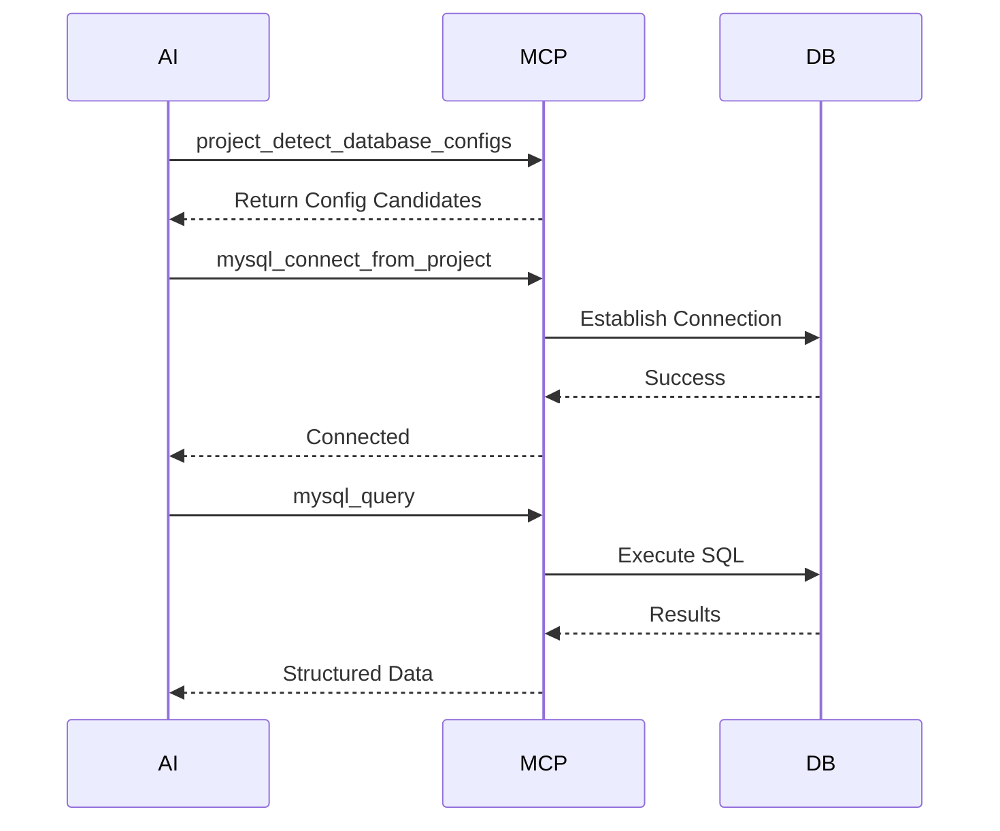

# Tool Reference

This document groups tools by job, so contributors and users can quickly identify the right call sequence.

## Shared Query Controls

Many query-style tools support:

- `offset`
- `max_rows`
- `timeout_ms`

Common pagination fields in results:

- `count`
- `offset`
- `has_more`
- `next_offset`
- `truncated`

These are especially important in agent workflows because large unbounded results are a bad fit for MCP conversations.

## Project Config Detection

### `project_detect_database_configs`

Purpose:

- scan a project directory
- locate common config files
- detect MySQL / PostgreSQL / Redis / SQLite settings

Use this first when the AI does not already know the database credentials.

## MySQL

### Connection

- `mysql_connect`
- `mysql_connect_from_project`
- `mysql_status`
- `mysql_disconnect`

### Query and Write

- `mysql_query`
- `mysql_exec`
- `mysql_exec_get_id`

### Stored Procedures

- `mysql_call_procedure`
- `mysql_create_procedure`
- `mysql_drop_procedure`
- `mysql_show_procedures`

### Notes

- `mysql_query` fits `SELECT`, `SHOW`, `DESCRIBE`
- `mysql_exec` fits DML and DDL
- `mysql_exec_get_id` is useful for insert flows that need the created ID
- `mysql_connect_from_project` should be preferred when credentials live inside project files

## PostgreSQL

### Connection

- `pgsql_connect`
- `pgsql_connect_from_project`
- `pgsql_status`
- `pgsql_disconnect`

### Query and Write

- `pgsql_query`
- `pgsql_exec`

### Metadata

- `pgsql_info`
- `pgsql_list_schemas`
- `pgsql_list_tables`
- `pgsql_list_columns`
- `pgsql_list_indexes`

### Notes

- `pgsql_exec` supports insert flows with `RETURNING`
- metadata tools should usually come before broad table queries
- `pgsql_connect_from_project` is the preferred entrypoint for Spring or config-driven projects

## Redis

### Connection

- `redis_connect`
- `redis_connect_from_project`
- `redis_status`
- `redis_disconnect`

### Operations

- `redis_command`
- `redis_lua`

### Notes

- `redis_command` supports both raw command strings and structured `args`
- `redis_connect_from_project` is ideal when Redis config is defined in `.env`, Spring config, or similar files

## SQLite

### Operations

- `sqlite_query`
- `sqlite_query_from_project`

### Notes

- SQLite uses a single query-style tool that can also execute writes
- `sqlite_query_from_project` resolves the database path from project config

## Recommended Call Sequences

### Project-Driven Connection

1. `project_detect_database_configs`
2. one of:
   `mysql_connect_from_project`
   `pgsql_connect_from_project`
   `redis_connect_from_project`
   `sqlite_query_from_project`
3. follow-up read or metadata tools

### Explicit-Credential Connection

1. direct connect tool
2. status check if needed
3. query or metadata tools

### Metadata-First Exploration

Recommended for PostgreSQL:

1. `pgsql_list_schemas`
2. `pgsql_list_tables`
3. `pgsql_list_columns`
4. `pgsql_list_indexes`

## Config Detection Coverage

Current project-aware detection supports common sources including:

- `.env`
- `.env.local`
- `application.yml`
- `application.yaml`
- `application.properties`
- `config.json`
- `config.toml`

Supported patterns include:

- host / port / username / password fields
- URL / DSN strings
- Spring datasource fields
- placeholder expansion like `${VAR}` and `${VAR:default}`

---

> **署名：** 明察网安、涉网犯罪技术侦查实验室
