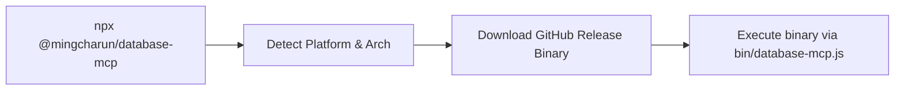

# `@mingcharun/database-mcp`

This package is the npm distribution wrapper for Database MCP.

## Quick Start

```bash
npx -y @mingcharun/database-mcp
```

## MCP Client Example

```json
{
  "mcpServers": {
    "database_mcp": {
      "command": "npx",
      "args": ["-y", "@mingcharun/database-mcp"]
    }
  }
}
```

## What Happens During Install



The npm package does not build Go source locally.

Instead it:

1. reads the npm version
2. detects platform and architecture
3. downloads the matching GitHub release binary
4. launches that binary through `bin/database-mcp.js`

## Maintainers

If you are maintaining the package rather than using it, continue with:

- [`docs/release.md`](../../docs/release.md)

---

> **署名：** 明察网安、涉网犯罪技术侦查实验室
